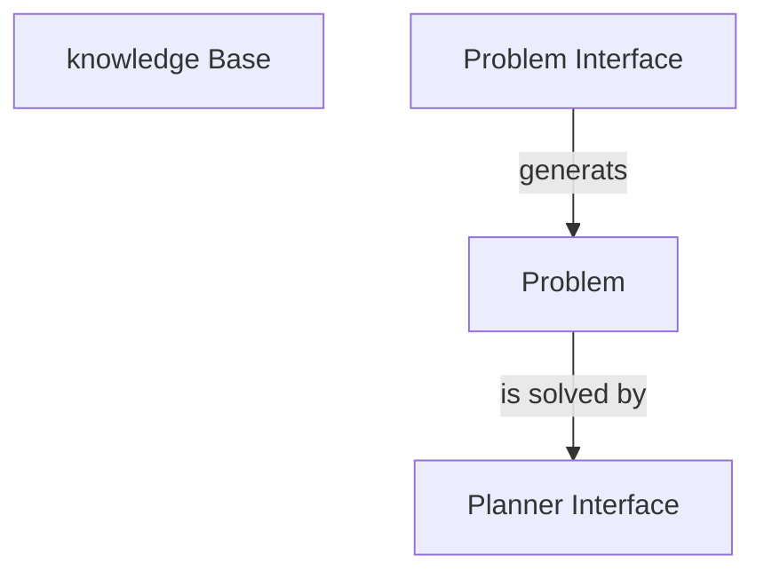

# General Procedure

1. Write the pddl files

2. Write the and launch 
    1. Start Kowledge Base Node with the following **parameters**
    ```
    domain_path:=path/to/domain.pddl
    problem_path:=path/to/problem.pddl
    use_unknowns:=false
    ```
    2. Start Problem Interface with the following **arguments**
    ```
    knowledge_base:=knowledge_base_node_name
    domain_path:=path/to/domain.pddl
    problem_path:=path/to/output/folder/
    problem_topic:=problem_instance
    ```
    3. Start Planner Interface
    ```
    use_problem_topic:=true
    problem_topic:="/rosplan_problem_interface/problem_instance"
    planner_topic:="planner_output"
    domain_path:=path/to/domain.pddl
    problem_path:=path/to/problem_generated_by_problem_interface
    data_path:=path/to/data
    planner_command:="timeout 10 $(find rosplan_planning_system)/common/bin/popf DOMAIN PROBLEM"
    ```

2. Generae the problem
```BASH
rosservice call /rosplan_problem_interface/problem_generation_server
```
3. Solve the problem
```BASH
rosservice call /rosplan_planner_interface/planning_server
```
4. Get the plan
```
rostopic echo /rosplan_planner_interface/planner_output -p
```

## General architecture 

